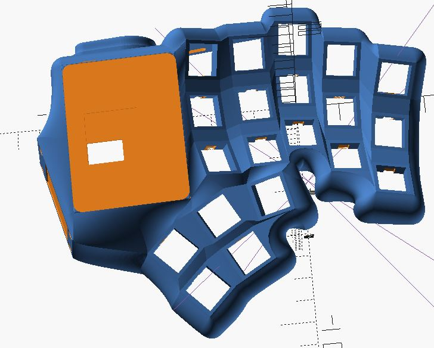

# Dactyl ManuForm Mini Keyboard

This is a fork of the [Dactyl-ManuForm](https://github.com/tshort/dactyl-keyboard). The Dactyl-Manuform is a fork of the [Dactyl](https://github.com/adereth/dactyl-keyboard) with the thumb cluster from [ManuForm](https://github.com/jeffgran/ManuForm).

# Custom Dactyl Mini
A Dactyl Mini completely reworked to use Affine Transformations, Bezier Curves and splines and Openscads Polyhedrons to build most of the model.

It has per column Stagger, Splay, Curvature and tilt along with a "flatter" thumb cluster

It also supports a tps-65 trackpad, st7789 screen, GX16 connecters for split transport and a rp2040 plus board

## Forks

- https://github.com/lebastaq/dactyl-manuform-mini-keyboard
- [Dactyl ManuForm Tight Keyboard](https://github.com/okke-formsma/dactyl-manuform-tight)
- https://github.com/carbonfet/dactyl-manuform
- [Track Beast](https://github.com/davekincade/dactyl-manuform-mini-keyboard/tree/dk-track-beast)
- [Tractyl ManuForm Keyboard](https://github.com/noahprince22/tractyl-manuform-keyboard)
- [Compactyl](https://github.com/dereknheiley/dactyl-manuform-tight)

## Features

- The use of sidenubs can be disabled. Sidenub should be disabled if you use Kailh, and Outemu. If you use Cherry MX, Gateron or Zealios switches, you can enable the sidenubs.
- Spaces for rentention tabs are added.
- One key in the thumb cluster has been removed. Other thumb keys are also adjusted.
- The total height is reduced and wire posts are removed. This results in a
  higher printing speed and a lower cost.
- Screw posts are moved inside. The holes are designed for TRISERT® thread inserts 145m3.

- A GX16 Mount is used instead of TRRS, code adapted from https://gist.github.com/jamiehs/de163e7d469e4fb4220e504b58613806
- Blackpill f411 holder adapted from https://github.com/darrenph1/dactyl-keyboard
- oled slot and mounting area (left-section) adapted from https://github.com/oysteinkrog/dactyl-manuform-mini-keyboard
- encoder hole from https://github.com/oysteinkrog/dactyl-manuform-mini-keyboard
- Thumb trackball and thumb area adapted from https://github.com/noahprince22/tractyl-manuform-keyboard
- Tenting stand and palm rest from https://github.com/noahprince22/tractyl-manuform-keyboard
- Adafruit IS31FL3731 screw mounts
- Joycon Joystick mounting (designed for the left hand so has to be mirrored)
- Cirque TM040040 Mount
- Mounting for Toggle Switch with Cover (Example https://thepihut.com/products/illuminated-toggle-switch-with-cover-red)

## Generate OpenSCAD and STL models

* Run `lein generate` or `lein auto generate`
* This will regenerate the `things/*.scad` files
* Use OpenSCAD to open a `.scad` file.
* Make changes to design, repeat `load-file`, OpenSCAD will watch for changes and rerender.
* When done, use OpenSCAD to export STL files

## License

Copyright © 2015-2018 Matthew Adereth, Tom Short and Leo Lou

The source code for generating the models is distributed under the [GNU AFFERO GENERAL PUBLIC LICENSE Version 3](LICENSE).

The generated models are distributed under the [Creative Commons Attribution-ShareAlike 4.0 International (CC BY-SA 4.0)](LICENSE-models).
